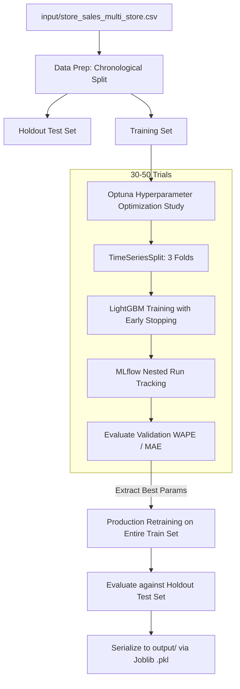

# Architecture & Training Pipeline: Demand Sensing ML Model

This page documents the end-to-end orchestration, data schemas, optimization strategies, and deployment paths for our edge-ready demand forecasting service.

## 1. Pipeline & Model Creation Flow

The core training pipeline is orchestrated by `src/demand_sensing/train.py`. It automates data preparation, hyperparameter tuning, cross-validation, production retraining, and evaluation.

## 2. Dataset Used

The model trains on `input/store_sales_multi_store.csv`. The dataset includes rich contextual and temporal features representing a convenience store environment:

- **Categorical & Entity Data:** `store_id`, `store_type`, `area_type`, `product_id`, `category`.
- **Operational & Event Flags:** `promo_flag`, `payday_flag`, `weekend_flag`, `holiday_flag`, `holiday_type`, `nearby_event_flag`, `stockout_flag`, `brownout_flag`.
- **Environmental Context:** `forecasted_temperature`, `forecasted_rainfall`, `forecasted_heat_index`.
- **Time & Sequence Features:** `hour_of_day`, `day_of_week`, `month`. \* **Causal Lags & Rolling Metrics:** `qty_sold_lag_1h/24h`, `foot_traffic_lag_1h/2h`, historical average sales (store and product level), and rolling demand means/standard deviations (e.g., 3h, 6h, 24h).

## 3. Technologies and Libraries Used

- **Core ML Framework:** `LightGBM` (`lgb.LGBMRegressor`) for the gradient-boosted decision trees.
- **Data Manipulation:** `pandas`, `numpy`.
- **Pipeline & Validation:** `scikit-learn` (for `TimeSeriesSplit`, `ColumnTransformer`, `Pipeline`, metrics).
- **Hyperparameter Optimization:** `optuna`.
- **Experiment Tracking:** `mlflow` (tracks nested runs for Optuna trials and final model logging). \* **Serialization:** `joblib`.
- **Exporting/Compilation:** `skl2onnx`, `onnxmltools` for converting the model to an ONNX graph.
- **Testing:** `pytest`.

## 4. How the Model is Optimized

- **Algorithm Search Space:** Optuna is used to search for the best hyperparameters such as `learning_rate`, `num_leaves`, `max_depth`, `subsample`, L1/L2 regularization (`reg_alpha`, `reg_lambda`), and categorical smoothing (`cat_smooth`, `cat_l2`).
- **Objective Metric:** The primary objective is to minimize WAPE (Weighted Absolute Percentage Error) on the validation folds, with `mae` used as the evaluation metric in LightGBM.
- **Pruning:** It uses Optuna's `MedianPruner` to stop unpromising trials early based on validation performance, saving compute time.
- **Early Stopping:** LightGBM's early stopping callback (50 rounds) is employed during training to prevent overfitting.

## 5. How it is Tested

Testing is done in two phases:

- **Holdout Evaluation:** Inside `train.py`, the final model's predictions are compared against a true holdout dataset.\*
- **Scenario-Based Unit Testing** (`tests/test_model.py`): Rather than just checking code execution, the test suite acts as a behavioral test for the ML model. It defines a baseline payload for a product and runs predictions under various modified scenarios, such as:
  _ **Weather Extremes:** High Heat Index, Typhoon / Prolonged Rain.
  _ **Events:** Barangay Fiesta + Payday, Holy Week, School Season. \* **Operational Anomalies:** Brownout/Blackout preparation, Rush hour.
  This ensures the model outputs logically sound demand forecasts (e.g., higher beverage sales during high heat, or higher necessity sales before a typhoon).

## 6. Output Creation and Exporting

The output creation process (`src/demand_sensing/export.py`) ensures the model can be deployed portably to edge devices or different tech stacks.

- **Pipeline Creation:** It loads the `.pkl` model and encoder, then wraps them in a unified scikit-learn `Pipeline`.
- **ONNX Conversion:** It uses `skl2onnx` and `onnxmltools` to convert this pipeline into an ONNX (Open Neural Network Exchange) format.
- **Custom Operators:** It registers custom LightGBM converter nodes so the ONNX graph understands the LightGBM trees natively.
- **Final Output:** It writes the compiled graph to a binary file: `output/agent_demand_2h.onnx`. This ONNX file contains both the feature preprocessing (categorical encoding) and the tree inferences, allowing it to be served via `onnxruntime` or FastAPI without requiring LightGBM or Pandas in the production runtime environment.
